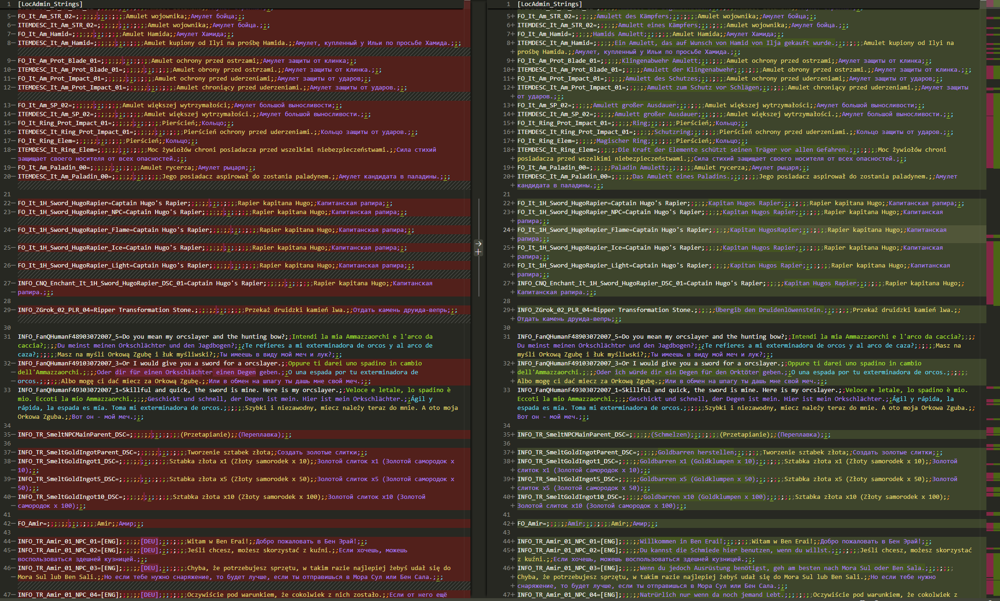

# Gothic 3 Union+ translations


### Visual Studio Code recommented settings
Install [Rainbow CSV plugin](https://marketplace.visualstudio.com/items?itemName=mechatroner.rainbow-csv) and add lines below to your settings.json file. 
```
"files.associations": {
    "stringtable.ini": "csv (semicolon)"
}
```


### Translation progress

<!-- START:translation-progress -->


<!-- END:translation-progress -->